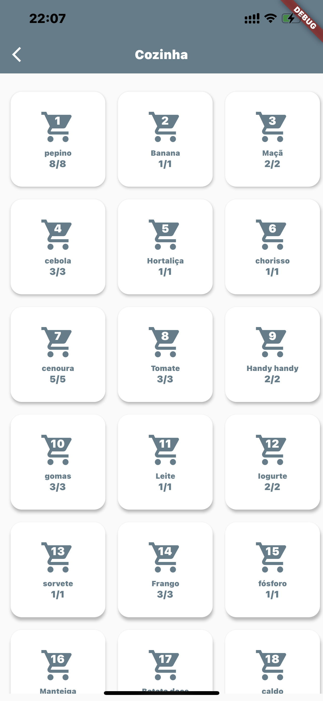
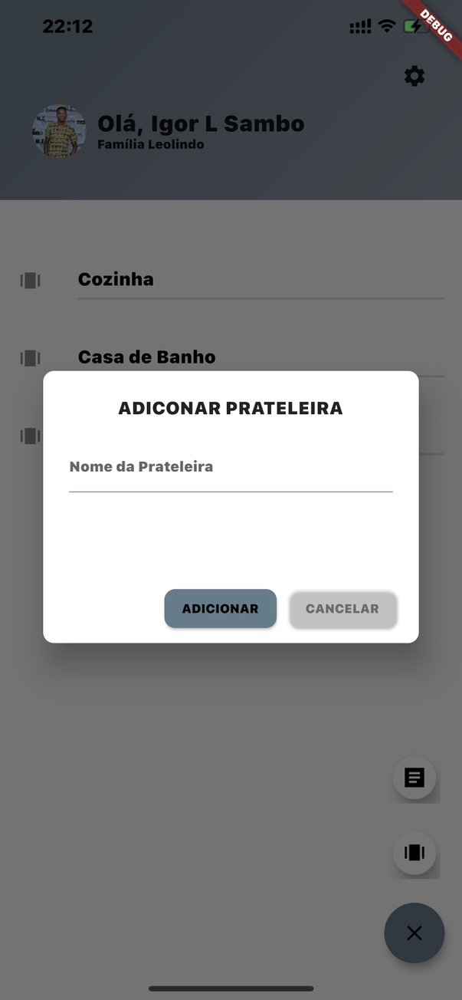

# Dapp

App to simplify control of needed stash at home

## Briefing

This project is not a starting point for a Flutter Application.

I am giving legs to a project I designed a couple months ago while planning to 
move from my parents home, though it was just a design I took the last 3 weeks or so 
(files creation dated 29th July) to eliminate all sorts of procrastination and made it a priority 
to develop and now testing with my younger brother who is giving me insights on how we can make it better.

Find screenshots below

## Screenshots

- 
- 
- 
- 

 [More Images Here](./screenshots/)

If you own a Android device, please try it out and give some feedback, specialy through contribuitions here on Github, but you can also find me through [my twitter](https://twitter.com/lsambo02).

### Use #dapp for public tweets

## ToDo
- [x] Create a family
- [x] Invite someone to a family
- [x] Enter a family by invite
- [x] Create shelves
- [x] Create products and add to shelve
- [x] See products in specific shelve
- [x] Edit quantities
- [x] Edit overall details of a product
- [x] Delete product
- [x] Rules to put in a "to buy list"
- [x] Estimated prices and "to buy list" with estimated value to spend
- [ ] Sub-shelves to a product that can have multiple brands/types
- [x] Share list in 3rd party apps
- [x] Allow user to automatically restock a product from "to buy list"
- [ ] Allow user to use different currencies based on his preferences

